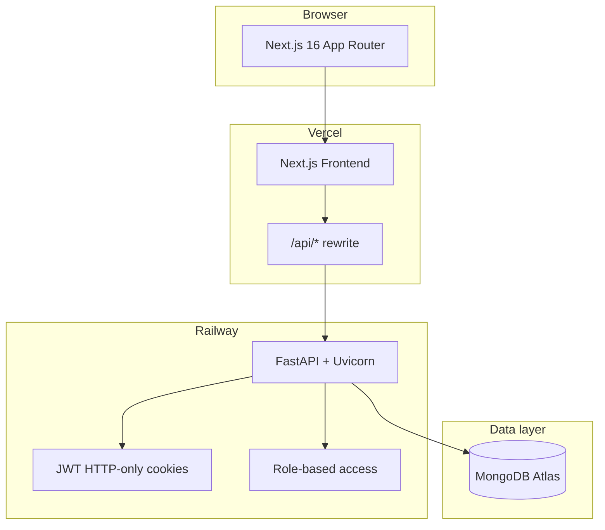

# Finance Dashboard

Full-stack personal finance application with role-based access, analytics, budgets, and CSV import/export.

**Live demo:** [finance-dashboard-delta-two.vercel.app](https://finance-dashboard-delta-two.vercel.app)

---

## Architecture



| Layer | Stack | Responsibility |
|-------|-------|----------------|
| Frontend | Next.js 16, React 19, TypeScript, Tailwind v4, Recharts | UI, charts, form validation (Zod) |
| API proxy | `next.config.ts` rewrites | Forwards `/api/*` to backend — cookies stay on Vercel origin |
| Backend | FastAPI, Motor, Pydantic, bcrypt, python-jose | Auth, RBAC, aggregations, CSV I/O |
| Database | MongoDB | Users, transactions (`records`), budgets |
| CI | GitHub Actions | Ruff + pytest, TypeScript + build, Playwright E2E |

### Request flow

1. Browser hits Vercel (e.g. `/dashboard`).
2. Next.js middleware checks `token` cookie; unauthenticated users go to `/auth/login`.
3. Client calls `/api/...` on the same origin.
4. Vercel rewrites to `BACKEND_URL` (Railway FastAPI).
5. FastAPI validates JWT cookie, applies RBAC, queries MongoDB.

---

## Features

- **Authentication** — Signup, login, logout with HTTP-only JWT cookies
- **RBAC** — `viewer` (own data), `analyst` (read-all + analytics), `admin` (full CRUD + import)
- **Dashboard** — KPIs, monthly trends, category pie chart, budget alerts, date filters
- **Budgets** — Monthly per-category limits with progress bars
- **Records** — Search, filter, paginate, inline admin edit
- **Analytics** — Transaction explorer with date/type/category filters
- **CSV** — Export (all roles, scoped); import (admin)
- **Secure signup** — New users are always `viewer`; admins promote roles

---

## Project structure

```
finance_dashboard/
├── src/                    # Next.js frontend (App Router)
│   ├── app/                # Pages: dashboard, records, budgets, analytics, auth
│   ├── components/         # Navbar, Toast, shared UI
│   ├── lib/apiClient.ts    # Axios with credentials
│   └── types/api.ts        # Shared TypeScript types
├── e2e/                    # Playwright E2E tests
├── backend/                # FastAPI API (deployed on Railway)
│   ├── routers/            # auth, dashboard, budgets, export, transactions, users
│   ├── tests/              # pytest suite (mongomock)
│   └── main.py
├── .github/workflows/ci.yml
├── playwright.config.ts
├── middleware.ts           # Cookie-based route protection
└── next.config.ts          # API rewrite to BACKEND_URL
```

---

## Getting started

### Prerequisites

- **Node.js 20+**
- **Python 3.12+**
- **MongoDB** (local or Atlas)

### 1. Backend

```bash
cd backend
cp .env.example .env   # set MONGODB_URI, JWT_SECRET
pip install -r requirements.txt
uvicorn main:app --reload --port 8000
```

### 2. Frontend

```bash
cp .env.example .env.local   # BACKEND_URL=http://127.0.0.1:8000
npm install
npm run dev
```

Open [http://localhost:3000](http://localhost:3000).

---

## Environment variables

### Frontend (`.env.local` / Vercel)

| Variable | Required | Description |
|----------|----------|-------------|
| `BACKEND_URL` | Yes | Railway HTTPS URL (no trailing slash). **Only secret the frontend needs.** |

> Do **not** put `MONGODB_URI` or `JWT_SECRET` on Vercel — they belong on the backend only.

### Backend (`backend/.env` / Railway)

See [`backend/.env.example`](backend/.env.example) for full list: `MONGODB_URI`, `JWT_SECRET`, `ALLOWED_ORIGINS`, `SECURE_COOKIES`, etc.

---

## Testing

```bash
# Backend unit/integration tests (no real MongoDB — uses mongomock)
npm run test:backend

# TypeScript check + production build
npm run lint
npm run build

# E2E (requires MongoDB on localhost:27017)
npm run test:e2e
```

CI runs all of the above on every push and pull request (see `.github/workflows/ci.yml`).

---

## Deployment (Vercel + Railway)

See [`DEPLOYMENT.md`](DEPLOYMENT.md) for the full checklist.

**Vercel (frontend):**
- Root directory: repository root
- Env: `BACKEND_URL` only
- Framework: Next.js 16 (auto-detected)

**Railway (backend):**
- Root directory: `backend`
- Env: `MONGODB_URI`, `JWT_SECRET`, `ALLOWED_ORIGINS` (include Vercel URL), `SECURE_COOKIES=true`

---

## Demo accounts

| Role | Email | Password |
|------|-------|----------|
| Admin | adminuser4@gmail.com | admin4123 |
| Analyst | analystuser@gmail.com | analyst123 |
| Viewer | user1@gmail.com | user123 |

---

## Author

Built by [Mayank Gautam](https://github.com/mayankgautam29)
